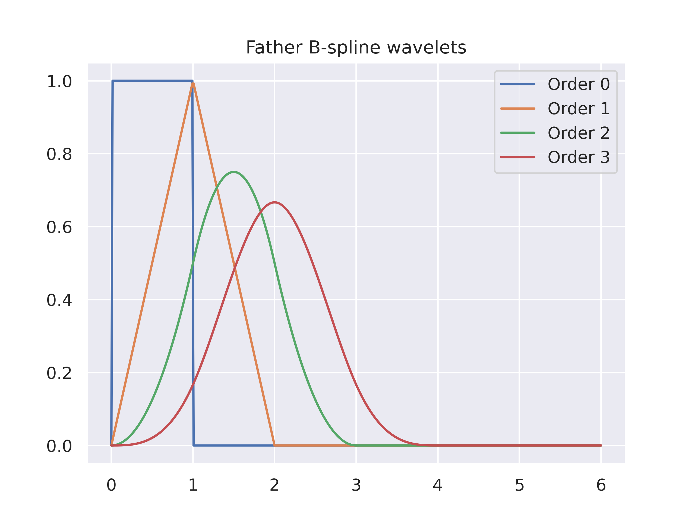
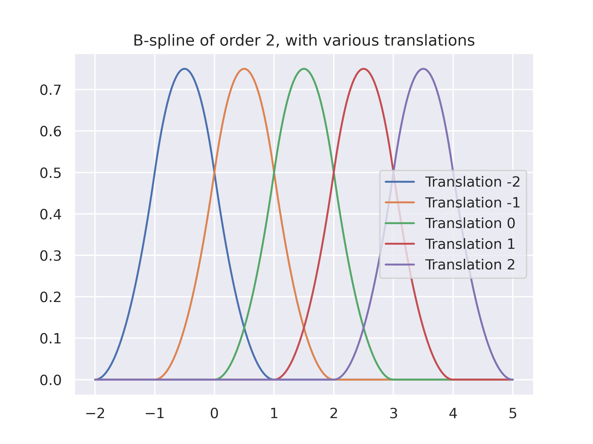

# WaveletRL
This is a repository that contains code for applying wavelets to linear value function approximation in reinforcement learning (RL). We particularly focus on B-Spline wavelets; implementing a fixed basis as well as adaptive ones.

- [WaveletRL](#waveletrl)
- [How this works](#how-this-works)
- [Code Structure](#code-structure)
- [Get Started](#get-started)
- [Examples](#examples)
  - [B-Spline Wavelets](#b-spline-wavelets)
  - [Value Functions for Mountain Car](#value-functions-for-mountain-car)
- [Repositories Used / Acknowledgements](#repositories-used--acknowledgements)
- [License](#license)
# How this works
This is fundamentally a different basis function for linear function approximation. The fixed B-Spline basis function performs comparably to the Fourier basis on Mountain Car and Acrobot. This repository also contains an adaptive basis, which can dynamically add in detail or interaction between different state dimensions as required.

# Code Structure
Most of the actual method code is in `adaptive/*` and `basis_functions/wavelet/bspline/*`, while the experiment code is in `experiments/*/*`. Most of these experiment file are quite similar, so please refer to `experiments/v1/v1_fixed.py` for some documentation on all of them.
```
├── adaptive                                        -> Utility code for adaptive basis sets
│   ├── awr
│   │   ├── awr_basisfunction.py
│   │   ├── awr_candidate_groups.py
│   │   └── awr_combination_basisfunction.py
│   ├── ibfdd
│   │   └── ibfdd_candidate_groups.py
│   └── relevance_data.py                           -> Tracking function relevances
├── basis_functions                                 -> General Basis functions
│   ├── adapative_basisset.py
│   ├── adapative_basisset_simple.py
│   ├── basis_function.py
│   ├── basis_set.py
│   ├── combination_basis_function.py
│   ├── fourier
│   │   └── fourier_basis_set.py
│   └── wavelet
│       └── bspline
│           ├── awr
│           │   ├── awr_bspline_basisfunction.py    -> Main B-Spline Basis function
│           │   └── awr_bspline_basisset.py
│           ├── bspline_basisfunction.py
│           ├── bspline_phi.py
│           ├── fixed_bspline_basisset.py           -> Fixed basis set
│           ├── ibfdd
│           │   └── ibfdd_bspline_basisset.py
│           └── mawb                                -> Everything to do with MAWB
│               ├── mawb_awr_candidate_groups.py
│               ├── mawb_bspline_basisset.py
│               └── mawb_ibfdd_candidate_groups.py
├── common                                          -> General Utilities
│   ├── runner.py
│   ├── types.py
│   └── utils.py
├── learners
│   └── sarsa_lambda.py                             -> Sarsa(Lambda) Code
├── experiments                                     -> Different experiments
│   ├── v1_fixed                                    -> Fixed Basis sets
│   ├── v2_awr                                      -> AWR
│   ├── v3_ibfdd                                    -> IBFDD
│   ├── v4_mawb                                     -> MAWB
│   └── v5_value_func                               -> Value Function Plotting
├── results                                         -> Contains the results of the experiments
├── env.yml                                         -> Conda environment 
├── run.sh                                          -> Use this to run a file

```
# Get Started
To get started, you can create a conda environment from the `env.yml` file,
```
conda create -f env.yml
```
Then, **to run any file in this repository, use `run.sh` instead of python directly**. You also need to run files from the repository root.
The experiment code is contained in `experiments/`, with slurm files reproducing our runs contained in `experiments/*/slurms/main_run_<env>`.

# Examples
## B-Spline Wavelets
Orders, scales and translations.
<p float="left" align="center">
  
  
  
</p>


The parent function (purple) is equal to a weighted sum of its children functions (which are simply scaled and translated copies of the parent).

## Value Functions for Mountain Car
Y-axis is velocity. Both values are normalised to between 0 and 1.
<p float="left" align="center">
  
  
</p>

<p float="left" align="center">
  
  
</p>

<p float="left" align="center">
  
  
</p>

# Repositories Used / Acknowledgements
- Much of the structure of this project is inspired by [RLPy](https://github.com/rlpy/rlpy)
- Code from [George Konidaris](https://cs.brown.edu/people/gdk/) ([here](fb_py)) was used as a starting point.
- This work is directly based on the PhD thesis of Michael Mitchley ([here](http://wiredspace.wits.ac.za/jspui/bitstream/10539/19298/1/MitchleyThesis.pdf)).

# License
[GPL-3](https://www.gnu.org/licenses/gpl-3.0.en.html)

